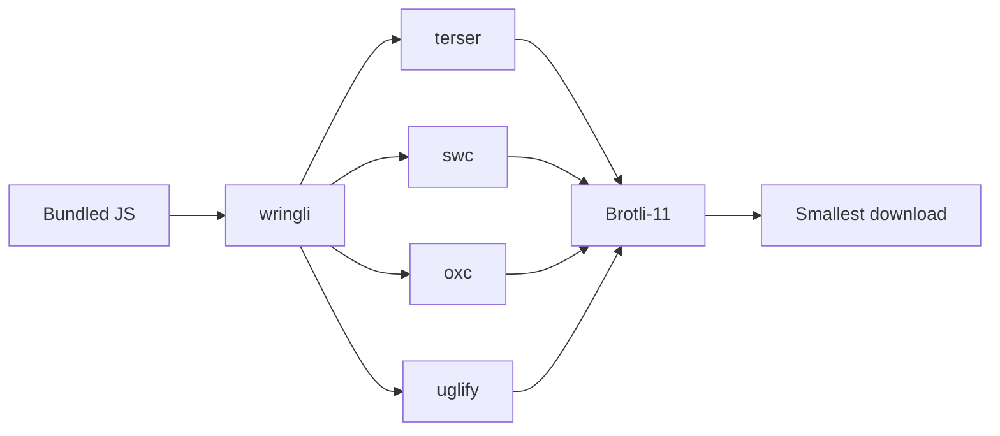

# wringli

[](https://github.com/alexanderdickson/wringli/actions/workflows/ci.yml)

Get the smallest over the wire JS bundles possible and never think about it again.

Run several JavaScript minifiers on the same file, score each by **Brotli-11**, keep the smallest download.

Most minifiers optimize the text they emit. Browsers then Brotli-compress that text. The shortest file is often not the smallest transfer. wringli does not invent a compressor. It runs terser, swc, oxc, and uglify (esbuild optional), then keeps the Brotli winner.

```bash
wringli dist/app.js -o dist/app.min.js
```

It sits after your bundler (esbuild, webpack, vite, rollup). It does not replace one.



## Install

Node 22+.

npm:

```bash
npm install --save-dev wringli
npx wringli --help
```

Yarn:

```bash
yarn add --dev wringli
yarn wringli --help
```

pnpm:

```bash
pnpm add -D wringli
pnpm wringli --help
```

Bun:

```bash
bun add -d wringli
bunx wringli --help
```

From this repo:

```bash
npm install
npx tsgo
node dist/wringli.js --help
```

## Usage

```bash
wringli dist/app.js -o dist/app.min.js
wringli --engines terser,swc,oxc,uglify,esbuild --module src/lib.js
wringli measure dist/*.js
```

`minify` is the default if you omit the command. `measure` prints raw, gzip-9, and Brotli-11 sizes.

| option             | default                 | notes                                              |
| ------------------ | ----------------------- | -------------------------------------------------- |
| `-o, --out <path>` | stdout                  | File or directory                                  |
| `-w, --write`      | off                     | Overwrite inputs                                   |
| `-m, --module`     | auto                    | Force ESM                                          |
| `--script`         | off                     | Force classic script                               |
| `--engines <list>` | `terser,swc,oxc,uglify` | `esbuild` is available but usually loses on Brotli |
| `--passes <n>`     | `3`                     | Compress passes per engine                         |
| `--quality <n>`    | `11`                    | Brotli quality used for scoring                    |
| `--suffix <ext>`   | none                    | Appended when `--out` is a directory               |
| `--json`           | off                     | Machine-readable report                            |
| `-q, --quiet`      | off                     | Errors only                                        |

uglify-js is skipped automatically on ESM input.

## Why this helps

No engine wins every file. The raw-size winner is often not the Brotli winner.

Corpus: unminified TypeScript 5.9 (`typescript.js`), three.js r182 (`three.module.js`), d3 7.9. All Brotli numbers are quality 11.

| minifier             | typescript  | three      | d3         |
| -------------------- | ----------- | ---------- | ---------- |
| terser (`passes: 3`) | **731,936** | 73,450     | 77,421     |
| swc                  | 732,470     | **72,905** | 77,182     |
| uglify-js            | 740,790     | n/a (ESM)  | **76,589** |
| esbuild              | 796,977     | 77,552     | 80,864     |

wringli keeps the bold cell per column. Versus always using esbuild that is about 5-8% smaller Brotli. Versus always using terser it is 0% / 0.7% / 1.1%. You do not have to guess which engine to pin.

oxc is in the default set. The table is the original four-engine corpus.

Originals, for context:

| file                 | raw       | Brotli-11 |
| -------------------- | --------- | --------- |
| typescript.js 5.9    | 9,112,572 | 1,150,586 |
| three.module.js r182 | 662,772   | 104,418   |
| d3.js 7.9            | 587,043   | 113,727   |

## Tradeoffs

You pay for that pick with **slower builds**. wringli runs every engine in the list (terser, swc, oxc, and uglify by default), then Brotli-compresses each result at quality 11 to decide the winner. The minifiers run in parallel, so wall time is closer to the slowest engine plus scoring, not four full builds in a row. CPU and memory still add up: four compressors and four Brotli passes instead of one.

That cost belongs in production or CI, where transfer size is what users download. Skip wringli in local `dev` / watch builds. Narrow the bill with `--engines terser,swc` if uglify is never useful (ESM), or drop `--passes` to `1` if you want a cheaper ensemble.

The size win is small if you already pin the right engine (0-1% vs always-terser). It is larger if you would have shipped esbuild's minify (about 5-8% on the corpus). The trade is minutes of extra compute vs guessing wrong forever.

## Library

```ts
import { minifyEnsemble, sizes } from 'wringli';
```

Same scoring helpers the CLI uses.

## Development

TypeScript (ESM), compiled with `tsgo`. Lint and format with oxlint / oxfmt. GitHub Actions runs `npm run check` on every push and pull request.

```bash
npm run build
npm test
npm run lint
npm run fmt
npm run check
```

## Author

[alexanderdickson](https://github.com/alexanderdickson), with vibecoding

## License

MIT
